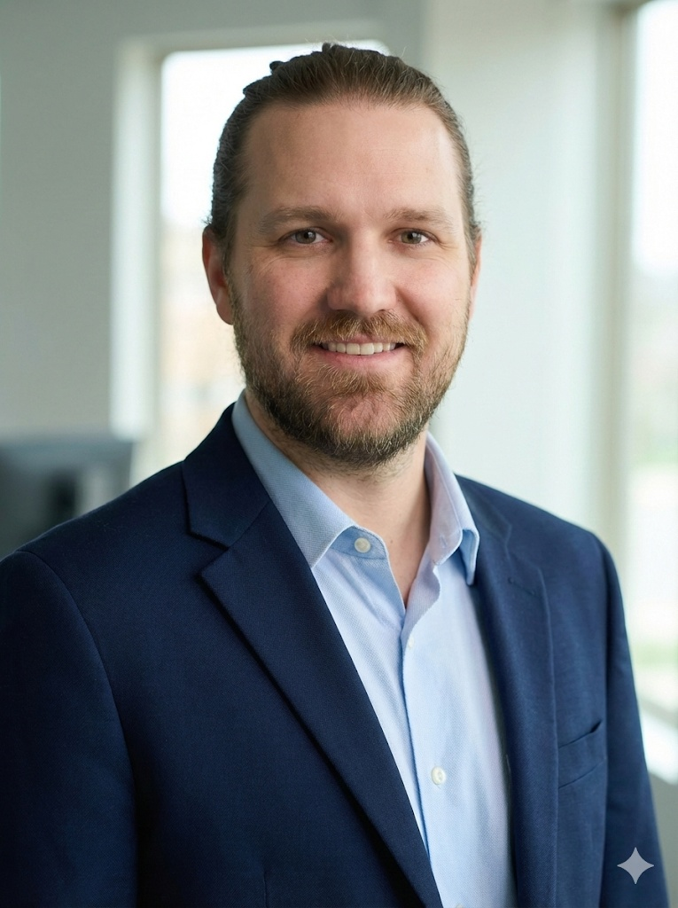

  

  
  
  
  
  

---

# Dakota Hollmann  

**Lead Data Engineer & Architect | Data Strategy & Cost Optimization ($350K+ Saved)** 📍 Denver Metropolitan Area  
🔗 [LinkedIn](https://www.linkedin.com/in/dakota-hollmann-/) / 💻 [GitHub](https://github.com/dmill166)

---

## 🧭 Executive Summary

I am a **Senior Data Engineer & Architect** who thrives at the intersection of complex technical systems and strategic business goals. Currently, I manage telemetry pipelines at a massive scale at **Charter Spectrum**—processing over **43B+ rows per hour (~6TB/day)**—while driving down compute costs and establishing engineering standards that empower my team.

With over **8 years of experience** across the data lifecycle and an **MBA in Data Analytics** in progress, I focus on being a "Force Multiplier." Whether it’s migrating legacy Teradata systems to AWS or building custom API ingestion frameworks in Python, I ensure that every technical decision is an investment in the company’s long-term profitability.

**Core Impact:**

* **Massive Scale:** Engineered ingestion for 30M+ customers and petabyte-scale annual volumes.
* **Strategy & ROI:** Delivered **$350K+** in annual cost savings through automation and workflow optimization.
* **Leadership:** Mentored **6 Data Engineers** and served as Technical Lead for an organization of 14.

---

## 🛠️ Core Competencies & Tech Stack
**Languages:** Python, SQL, Bash  
**Cloud & Big Data:** AWS (EMR, Lambda, Glue, Athena, S3, Step Functions), Spark/PySpark, Snowflake, Redshift  
**Architecture:** Distributed Systems, ETL/ELT Design, Serverless Ingestion, Cost Optimization (FinOps)  
**DevOps & Tooling:** Git, GitHub Actions, Terraform, Airflow, JIRA APIs, Docker  
**Analytics:** Data Quality Frameworks, Tableau, Alteryx, PowerBI  

  
  
  
  
   
  
  
  
  
   
  
  
  
  

---

## 👨‍💻 Professional Experience

### **Senior Data Engineer (Contract)** @ [Spectrum](https://www.spectrum.com/)
*(Dec 2023 – Present)*
* **Massive-Scale Telemetry:** Engineered high-throughput ingestion and analysis pipelines processing **43B+ rows per hour (~6TB/day)** for a 30M+ customer enterprise.
* **API Ingestion Framework:** Developed a serverless ingestion engine using AWS Lambda, Python, and Athena to poll JIRA APIs and automate partition-loading into S3 via parquet.
* **Performance Optimization:** Migrated legacy HiveQL workloads to Spark on EMR 6.x, reducing daily runtimes by 5 hours and securing **$10K** in annual compute cost savings.
* **Engineering Standards:** Advanced team maturity by authoring a modular utility framework utilizing inheritance and unit-testing (**141+ tests**) to ensure production reliability.
* **Technical Mentorship:** Led the technical onboarding and professional development of 6 Data Engineers, conducting code reviews and guiding best practices for AWS and Git-based workflows.

<strong><em>🔻 Click to view Technical Environment & Additional Context</em></strong>

* **Technologies:** AWS [S3, Lambda, Step Functions, EMR, CloudShell, EventBridge], Python, PySpark, VS Code, GitLab.
* **Impact Detail:** Re-architected a legacy Bash-based runtime metric collector to remove unnecessary compute overhead, saving 45–90 seconds per job across 600+ workflows.
* **Security:** Partnered with networking and security teams to establish cross-VPC access patterns for data retrieval systems.

---

### **5G Senior Data Analyst** @ [DISH Wireless](https://www.dish.com)
*(Mar 2023 – Dec 2023)*
* **FCC Compliance Automation:** Engineered an automated site-validation framework using Alteryx to support the June 14, 2023 FCC 5G deployment commitments.
* **Operational Throughput:** Increased audit capacity from 4 sites/day to unlimited automated audits, reducing site review time from ~2 hours to **5 minutes (90%+ reduction)**.
* **Technical Leadership:** Served as Technical Lead for an organization of 14 Analysts and Engineers, including the direct management of an India-based data resource.
* **Data Enablement:** Architected the data-polling layer and sourced service accounts for executive 5G rollout dashboards using Redshift, Athena, and Snowflake.

<strong><em>🔻 Click to view Technical Environment & Additional Context</em></strong>

* **Technologies:** Alteryx, Snowflake, AWS Redshift, Tableau, SQL Server, Python.
* **Process:** Owned daily multi-dataset validations for 5G site integration during high-pressure launch windows.
* **KPI Design:** Designed operational KPIs and reporting models improving SLA transparency across APAC, EMEA, and Americas regions.

---

<strong>📂 Previous Experience (Arrow Electronics, DISH Network, Early Career)</strong>

 

**ETL Engineer II** @ [Arrow Electronics](https://www.arrow.com/) _(May 2022 – Mar 2023)_  

* **Warehouse Optimization:** Developed and tuned complex ETL workflows (Informatica, Oracle, Teradata) supporting a multi-terabyte, 24/7 global supply chain warehouse.
* **Storage Efficiency:** Engineered a Hadoop-to-SQL pipeline that achieved a **90% reduction** in storage footprint through advanced normalization.
* **Global SLA Performance:** Constructed rolling performance dashboards to track operational SLA metrics with 93–96% accuracy across three continents.

**Technical Product Owner** @ [Arrow Electronics](https://www.arrow.com/) _(Feb 2022 – May 2022)_  

* **Agile Delivery:** Prioritized backlogs and managed delivery across 3 Agile sub-teams, bridging communication between 10+ business stakeholders and 20+ technical members.

**Software Engineer III (Database Development)** @ [DISH Network](https://www.dish.com) _(Jun 2021 – Feb 2022)_  

* **Enterprise Cloud Migration:** Orchestrated the technical validation of **150+ database objects** during a large-scale Teradata to AWS (Redshift/Snowflake) migration.
* **DevOps Leadership:** Spearheaded the Git adoption and implementation project for a team of 8 Data Engineers.

**Senior Business Operations Analyst** @ [DISH Network](https://www.dish.com) _(Oct 2020 – Jun 2021)_  

* **High-Volume Operations:** Managed complex queue logic and staffing models for 100K+ daily customer contacts and 2,000+ FTEs.
* **Financial Impact:** Identified and delivered **$250K+** in annual cost savings through efficiency reporting.

*(Prior roles: Business Operations Analyst I-III, WFM Specialist, Retail Leadership)*

---

## 🎓 Education

**Master of Business Administration (MBA)**, Concentration in *Data Analytics*  
[Florida Gulf Coast University](https://onlinedegree.fgcu.edu/programs/mba/) – Fort Myers, FL *(Expected 2026)*  
*Focusing on the intersection of advanced data architecture, business profitability, and cost-optimization strategy.*

**Bachelor of Science (BS)** in Computer Science, Minor in Mathematics  
[Metropolitan State University of Denver](https://www.msudenver.edu/computer-sciences/computer-science-major-bs/) – Denver, CO *(2022)*  
*Currently serving as an Alumni Member for the Computer Science and DSML Advisory Boards.*

**Associate of General Studies**  
[Arapahoe Community College](https://www.arapahoe.edu/) – Littleton, CO *(2020)*

**Career Studies Certificate** in Computer Repair Technician  
[Southwest Virginia Community College](https://sw.edu/) – Cedar Bluff, VA *(2018)*

**Associate of Arts and Sciences** in Education  
[Southwest Virginia Community College](https://sw.edu/) – Cedar Bluff, VA *(2017)*

---

## 🎤 Public Speaking & Leadership

**Computer Science & DSML Advisory Board Member** @ [MSU Denver](https://www.msudenver.edu/) *(May 2020 – Present)*  

* **Governance:** Currently serving as an Alumni Member for the **Computer Science** and **Data Science & Machine Learning (DSML)** Advisory Boards, guiding curriculum alignment with evolving industry standards, workforce readiness, and ABET accreditation requirements.
* **Mentorship & Speaking:** Regularly invited guest speaker and mentor; recently presented *"Nodes, Edges, and Elevator Pitches: Networking Like a Computer Scientist"* to 40+ early-career technologists.

<strong><em>🔻 Click to view Full Speaking & Engagement Timeline</em></strong>

### 2026

* **Feb 09** — **Guest Lecturer**, CS 4360 (Senior Experience)  
  *Scheduled engagement to discuss enterprise data architecture and career navigation with senior undergraduates.*

### 2025

* **Dec 05** — **Industry Participant**, CACED Senior Project Day & Networking Lunch  
* **Nov 20** — **Guest Speaker**, CS 3210 (Principles of Programming Languages) & CS 3700 (Computer Networks)  
  *Shared industry insights on job search strategies, technical interviewing, and navigating life after graduation.*
* **Nov 03** — **Guest Speaker**, CS 1030 (Computer Science Principles)  
  *Virtual presentation on "How to Get a Job in CS," covering interviewing techniques, networking strategies, and essential developer tools.*
* **Oct 23** — **Industry Panelist**, CS 1050 (Computer Science 1)  
  *Moderated Q&A for freshmen covering core competency building (problem-solving, collaboration), internship navigation, and early career advice.*
* **Aug 14** — **Invited Member**, Inaugural DSML Advisory Board Meeting  
  *Selected to serve on the founding board to shape the Data Science & Machine Learning curriculum strategy.*
* **Jul 12** — **Industry Mentor & Strategy Lead**, Sustainability Hub Hackathon  
  *Partnered with Charter Spectrum's women's resource group to review **"Empowering Colorado,"** an LLM/RAG-based sustainability data platform. Advised students and faculty on data democracy, scalability, and the technical roadmap for creating a centralized repository of credible climate data.*
* **May 28** — **Organizer**, "Learning By Design" Workshop (Charter Spectrum Partnership)  
* **Apr 18** — **Featured Alumnus**, Spring 2024 CS Department Newsletter  
* **Apr 10** — **Guest Speaker**, CS 3810 (Principles of Database Systems) — *Career Navigation & Architecture* * **Feb 03** — **Guest Speaker**, CS 4360 (Senior Experience) — *"Life After Graduation"* ### 2024

* **Aug 21** — **Volunteer**, Computer Science Welcome Day  
* **Apr 29** — **Presenter**, MSU Denver ACM Chapter [(View Slides)](https://docs.google.com/presentation/d/1ShD4CKBG_irWy2S_FXP6XZz-FTjg6TYlSuR0SKq81Ok/edit?usp=sharing)  
* **Mar 29** — **Participant**, CS Advisory Board Meeting  

### 2022

* **Feb 17** — **Guest Speaker**, CS 3810 (Principles of Database Systems) [(View Slides)](https://docs.google.com/presentation/d/1XLGgOu0HLEjwfn96tfc6Zrc3Z1-kV2kJT_vWEWtuFso/edit?usp=sharing)  
* **May 13** — **Graduate**, MSU Denver (Bachelor of Science)  

### 2020

* **Aug 18** — **Guest Speaker**, CS 1030 (Computer Science Principles) [(View Slides)](https://docs.google.com/presentation/d/1smIEWqqz8zEXxZlX5BTxynWKX47LINaJps0dzOaeWOM/edit?usp=sharing)  

---

## 📄 Download Resume

[Download PDF](DHollmann_Resume.pdf)

---
